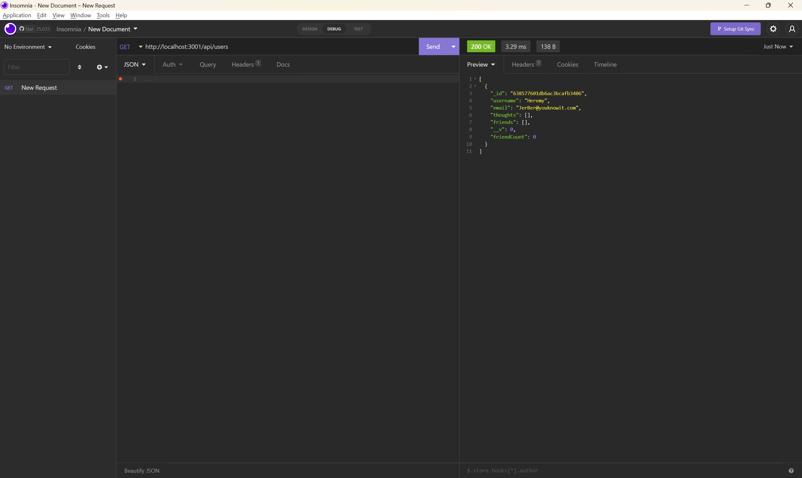

# MongoDB

## Description
A social media database! For all your social networking needs.  Create an account, add some thoughts and friends, and give some reactions!
      
## Table of Contents
* [Installation](#installation)
* [Usage](#usage)
* [Screenshot](#screenshot)
* [Credits](#credits)
* [License](#license)
* [Contributing](#contributing)
* [Questions](#questions)
      
## Installation
Once we have our Github, terminal, and vscode ready to go, we need to:
npm i
npm run seed
node server.js
      
## Usage
Create a user account to be able to post.  You can add and delete thoughts and reactions and friends.
      
## Screenshot:

 The following video demonstrates the application functionality:

 

## Credits
Joe Rehfuss for teaching us. W3Schools, Mozilla, and StackOverflow. Lindsey Fitzgerald for a Mongo tutorial. Austin the TA for some assitance.

## License
This application is covered under Creative Commons license. See repo for license.
      
## Contributing
You needn't contribute, but if you'd like to, please follow the rules in the Code of Conduct in repo.
  
## Questions
[Link to diangigrich's GitHub](https://github.com/diangigrich)

[Contact Us](mailto:slayer_barrett_@hotmail.com)